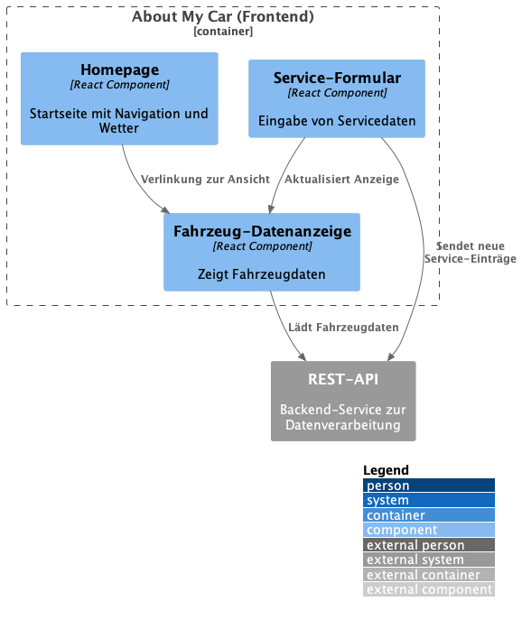

= arc42 Architektur-Dokumentation: About My Car
:doctype: book
:toc: left
:toclevels: 2
:sectnums:
:icons: font
:imagedir: img/
:source-highlighter: highlightjs

== Einleitung und Ziele

=== Aufgabenstellung

„About My Car“ ist eine Webanwendung zur Eingabe und Anzeige von Fahrzeuginformationen. Nutzer können ihre Daten lokal erfassen und verwalten. Die Anwendung läuft vollständig im Browser.

=== Qualitätsziele

|===
| Qualität        | Ziel

| Usability       | Intuitive, einfache Nutzung durch Benutzer
| Wartbarkeit     | Klare Strukturierung des Codes
| Portabilität    | Bereitstellung über Docker
| Erweiterbarkeit | Einfache Integration neuer Features
|===

=== Stakeholder

|===
| Rolle          | Interesse

| Endnutzer      | Einfache Verwaltung ihrer Fahrzeugdaten
| Entwickler     | Erweiterbarkeit, einfacher Code
| Administratoren| Einfaches Deployment per Docker
|===

== Randbedingungen

* Frontend: React mit TypeScript
* Backend: Node.js mit Express
* Persistenz: PostgreSQL
* Drittanbieter: link:https://open-meteo.com[Open Meteo API]
* Bereitstellung über Docker

== Kontextabgrenzung

=== Kontextdiagramm

image:img/context.png[align="center", alt="Kontextdiagramm"]

=== Erläuterung

* Benutzer interagieren über den Webbrowser
* Die Anwendung kommuniziert mit dem Backend über REST-API
* Das Backend greift auf die PostgreSQL-Datenbank zu
* Die Anwendung nutzt die Open Meteo API für Wetterdaten
* Die Komponenten werden in Docker-Containern bereitgestellt

== Lösungsstrategie

* Clientseitige mit React
* Verwendung von TypeScript zur besseren Wartbarkeit
* Deployment über Docker (statische App)
* Fokus auf einfache, benutzerfreundliche UI

== Bausteinsicht

=== Hauptkomponenten

=== Beschreibung

* `Homepage`: Startseite mit Navigation und Wettervorhersagen
* `Fahrzeug-Datenanzeige`: Anzeige aller Informationen
* `Service-Formular`: Eingabe von Servicedaten

== Laufzeitsicht

=== Nutzungsszenario: Service erfassen

. Nutzer öffnet die Anwendung im Browser.
. Nutzer loggt sich ein.
. Nutzer navigiert zur Seite „Auto“.
. Nutzer klickt auf „Services bearbeiten“.
. Die Formularansicht wird angezeigt.
. Nutzer füllt das Formular aus.
. Nach Absenden erscheinen die Daten in der Anzeige-Komponente.

== Verteilungssicht

* Webapp läuft im Browser
* Bereitstellung über Docker-Container
* Nginx als Reverse Proxy
* Backend und Datenbank ebenfalls in Containern
* Datenbank: PostgreSQL
* Backend: Node.js mit Express
* Frontend: React mit TypeScript
* Statische Bereitstellung der App über Nginx

== Querschnittliche Konzepte

* **State-Management**: über React `useState`, `useEffect`
* **UI**: minimalistisch und benutzerfreundlich
* **Build Tooling**: Vite

== Entwurfsentscheidungen

* React für die UI-Entwicklung
* Statische Bereitstellung per Docker
* Typsicherheit durch TypeScript

== Qualitätsanforderungen

|===
| Szenario                          | Erwartetes Verhalten

| Frontend-Performance         | Schnelle Ladezeiten, keine Verzögerungen
| Backend-Performance          | Schnelle API-Antworten, keine Zeitüberschreitungen
| Datenbank-Performance        | Schnelle Abfragen, keine Blockierungen
| Sicherheit                   | Nutzerdaten geschützt, Authentifizierung
| Verfügbarkeit                | Hohe Verfügbarkeit gewährleistet
|===

== Risiken & Technische Schulden
* **Risiken**:
    * Abhängigkeit von Drittanbieter-API
    * Performance-Probleme bei großen Datenmengen
* **Maßnahmen**:
    * Monitoring der API-Nutzung
    * Optimierung der Datenbankabfragen
* **Technische Schulden**:
    * Iniziale Authentifizierung einfach gehalten, optimierbar in zukünftige Versionen (OAuth2)

== Glossar

* **API**: Application Programming Interface
* **UI**: User Interface
* **REST**: Representational State Transfer
* **Docker**: Containerisierungstechnologie
* **PostgreSQL**: Relationale Datenbank
* **Nginx**: Webserver und Reverse Proxy
* **React**: JavaScript-Bibliothek für UI-Entwicklung
* **TypeScript**: Typsichere Erweiterung von JavaScript
* **Vite**: Build-Tool für moderne Webanwendungen
* **Container**: Leichtgewichtige, portable Umgebung für Anwendungen
* **Reverse Proxy**: Vermittler zwischen Client und Server

