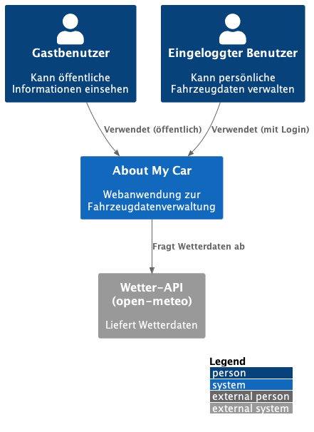
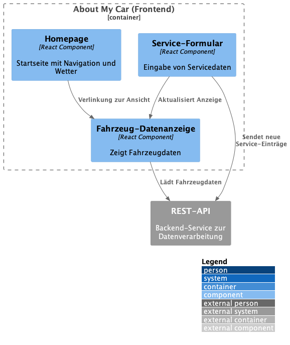
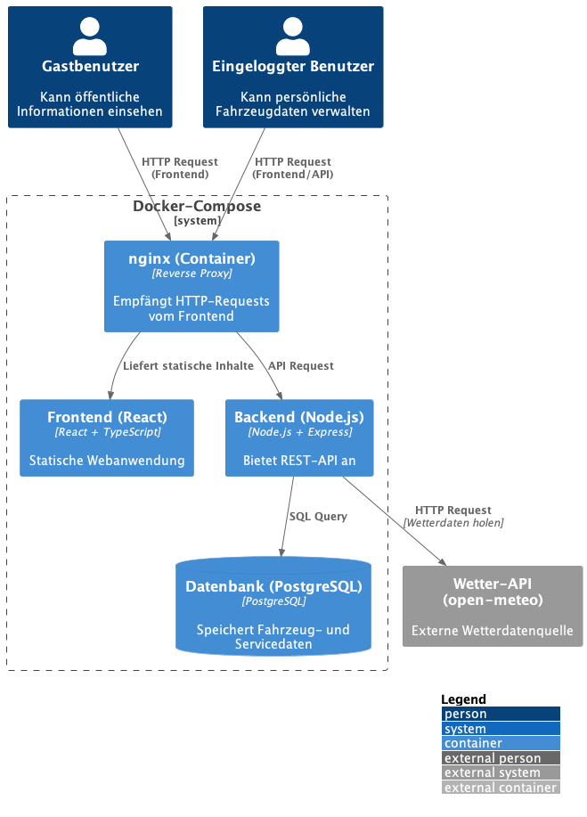

# arc42 Architektur-Dokumentation: About My Car

## Einleitung und Ziele

### Aufgabenstellung

„About My Car“ ist eine Webanwendung zur Eingabe und Anzeige von Fahrzeuginformationen. Nutzer können ihre Daten lokal erfassen und verwalten. Die Anwendung läuft vollständig im Browser.

### Qualitätsziele

| Qualität        | Ziel                     |
|-----------------|--------------------------|
| Usability       | Intuitive, einfache Nutzung durch Benutzer |
| Wartbarkeit     | Klare Strukturierung des Codes |
| Portabilität    | Bereitstellung über Docker |
| Erweiterbarkeit | Einfache Integration neuer Features |

### Stakeholder

| Rolle           | Interesse                |
|-----------------|--------------------------|
| Endnutzer       | Einfache Verwaltung ihrer Fahrzeugdaten |
| Entwickler      | Erweiterbarkeit, einfacher Code |
| Administratoren | Einfaches Deployment per Docker |

## Randbedingungen

- Frontend: React mit TypeScript
- Backend: Node.js mit Express
- Persistenz: PostgreSQL
- Drittanbieter: [Open Meteo API](https://open-meteo.com)
- Bereitstellung über Docker

## Kontextabgrenzung

### Kontextdiagramm

### Erläuterung

- Benutzer interagieren über den Webbrowser
- Die Anwendung kommuniziert mit dem Backend über REST-API
- Das Backend greift auf die PostgreSQL-Datenbank zu
- Die Anwendung nutzt die Open Meteo API für Wetterdaten
- Die Komponenten werden in Docker-Containern bereitgestellt

## Lösungsstrategie

- Clientseitige Entwicklung mit React
- Verwendung von TypeScript zur besseren Wartbarkeit
- Deployment über Docker (statische App)
- Fokus auf einfache, benutzerfreundliche UI

## Bausteinsicht

### Hauptkomponenten

### Beschreibung

- `Homepage`: Startseite mit Navigation und Wettervorhersagen
- `Fahrzeug-Datenanzeige`: Anzeige aller Informationen
- `Service-Formular`: Eingabe von Servicedaten

## Laufzeitsicht

### Nutzungsszenario: Service erfassen

1. Nutzer öffnet die Anwendung im Browser.
2. Nutzer loggt sich ein.
3. Nutzer navigiert zur Seite „Auto“.
4. Nutzer klickt auf „Services bearbeiten“.
5. Die Formularansicht wird angezeigt.
6. Nutzer füllt das Formular aus.
7. Nach Absenden erscheinen die Daten in der Anzeige-Komponente.

## Verteilungssicht

- Webapp läuft im Browser
- Bereitstellung über Docker-Container
- Nginx als Reverse Proxy
- Backend und Datenbank ebenfalls in Containern
- Datenbank: PostgreSQL
- Backend: Node.js mit Express
- Frontend: React mit TypeScript
- Statische Bereitstellung der App über Nginx

## Querschnittliche Konzepte

- **State-Management**: über React `useState`, `useEffect`
- **UI**: minimalistisch und benutzerfreundlich
- **Build Tooling**: Vite

## Entwurfsentscheidungen

- React für die UI-Entwicklung
- Statische Bereitstellung per Docker
- Typsicherheit durch TypeScript

## Qualitätsanforderungen

| Szenario                  | Erwartetes Verhalten                     |
|---------------------------|------------------------------------------|
| Frontend-Performance      | Schnelle Ladezeiten, keine Verzögerungen |
| Backend-Performance       | Schnelle API-Antworten, keine Zeitüberschreitungen |
| Datenbank-Performance     | Schnelle Abfragen, keine Blockierungen   |
| Sicherheit                | Nutzerdaten geschützt, Authentifizierung |
| Verfügbarkeit             | Hohe Verfügbarkeit gewährleistet        |

## Risiken & Technische Schulden

- **Risiken**:
    - Abhängigkeit von Drittanbieter-API
    - Performance-Probleme bei großen Datenmengen
- **Maßnahmen**:
    - Monitoring der API-Nutzung
    - Optimierung der Datenbankabfragen
- **Technische Schulden**:
    - Iniziale Authentifizierung einfach gehalten, optimierbar in zukünftige Versionen (OAuth2)

## Glossar

- **API**: Application Programming Interface
- **UI**: User Interface
- **REST**: Representational State Transfer
- **Docker**: Containerisierungstechnologie
- **PostgreSQL**: Relationale Datenbank
- **Nginx**: Webserver und Reverse Proxy
- **React**: JavaScript-Bibliothek für UI-Entwicklung
- **TypeScript**: Typsichere Erweiterung von JavaScript
- **Vite**: Build-Tool für moderne Webanwendungen
- **Container**: Leichtgewichtige, portable Umgebung für Anwendungen
- **Reverse Proxy**: Vermittler zwischen Client und Server
